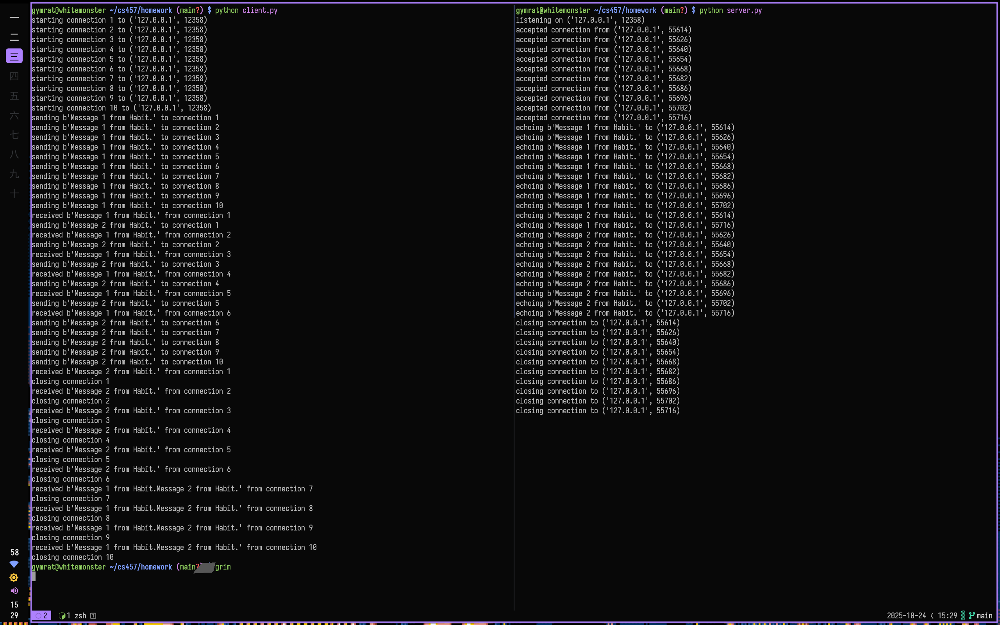

Client:

```
starting connection 1 to ('127.0.0.1', 12358)
starting connection 2 to ('127.0.0.1', 12358)
starting connection 3 to ('127.0.0.1', 12358)
starting connection 4 to ('127.0.0.1', 12358)
starting connection 5 to ('127.0.0.1', 12358)
starting connection 6 to ('127.0.0.1', 12358)
starting connection 7 to ('127.0.0.1', 12358)
starting connection 8 to ('127.0.0.1', 12358)
starting connection 9 to ('127.0.0.1', 12358)
starting connection 10 to ('127.0.0.1', 12358)
sending b'Message 1 from Habit.' to connection 1
sending b'Message 1 from Habit.' to connection 2
sending b'Message 1 from Habit.' to connection 3
sending b'Message 1 from Habit.' to connection 4
sending b'Message 1 from Habit.' to connection 5
sending b'Message 1 from Habit.' to connection 6
sending b'Message 1 from Habit.' to connection 7
sending b'Message 1 from Habit.' to connection 8
sending b'Message 1 from Habit.' to connection 9
sending b'Message 1 from Habit.' to connection 10
received b'Message 1 from Habit.' from connection 1
sending b'Message 2 from Habit.' to connection 1
sending b'Message 2 from Habit.' to connection 2
sending b'Message 2 from Habit.' to connection 3
sending b'Message 2 from Habit.' to connection 4
sending b'Message 2 from Habit.' to connection 5
sending b'Message 2 from Habit.' to connection 6
sending b'Message 2 from Habit.' to connection 7
sending b'Message 2 from Habit.' to connection 8
sending b'Message 2 from Habit.' to connection 9
sending b'Message 2 from Habit.' to connection 10
received b'Message 1 from Habit.' from connection 2
received b'Message 1 from Habit.Message 2 from Habit.' from connection 3
closing connection 3
received b'Message 1 from Habit.Message 2 from Habit.' from connection 4
closing connection 4
received b'Message 1 from Habit.Message 2 from Habit.' from connection 5
closing connection 5
received b'Message 1 from Habit.Message 2 from Habit.' from connection 6
closing connection 6
received b'Message 2 from Habit.' from connection 1
closing connection 1
received b'Message 2 from Habit.' from connection 2
closing connection 2
received b'Message 1 from Habit.Message 2 from Habit.' from connection 7
closing connection 7
received b'Message 1 from Habit.Message 2 from Habit.' from connection 8
closing connection 8
received b'Message 1 from Habit.Message 2 from Habit.' from connection 9
closing connection 9
received b'Message 1 from Habit.Message 2 from Habit.' from connection 10
closing connection 10
```

Server:

```
listening on ('127.0.0.1', 12358)
accepted connection from ('127.0.0.1', 54866)
accepted connection from ('127.0.0.1', 54868)
accepted connection from ('127.0.0.1', 54874)
accepted connection from ('127.0.0.1', 54886)
echoing b'Message 1 from Habit.' to ('127.0.0.1', 54866)
echoing b'Message 1 from Habit.Message 2 from Habit.' to ('127.0.0.1', 54868)
echoing b'Message 1 from Habit.Message 2 from Habit.' to ('127.0.0.1', 54874)
accepted connection from ('127.0.0.1', 54900)
echoing b'Message 2 from Habit.' to ('127.0.0.1', 54866)
closing connection to ('127.0.0.1', 54868)
echoing b'Message 1 from Habit.Message 2 from Habit.' to ('127.0.0.1', 54886)
accepted connection from ('127.0.0.1', 54910)
closing connection to ('127.0.0.1', 54866)
closing connection to ('127.0.0.1', 54874)
echoing b'Message 1 from Habit.Message 2 from Habit.' to ('127.0.0.1', 54900)
accepted connection from ('127.0.0.1', 54914)
closing connection to ('127.0.0.1', 54886)
echoing b'Message 1 from Habit.Message 2 from Habit.' to ('127.0.0.1', 54910)
accepted connection from ('127.0.0.1', 54920)
closing connection to ('127.0.0.1', 54900)
echoing b'Message 1 from Habit.Message 2 from Habit.' to ('127.0.0.1', 54914)
accepted connection from ('127.0.0.1', 54932)
closing connection to ('127.0.0.1', 54910)
echoing b'Message 1 from Habit.Message 2 from Habit.' to ('127.0.0.1', 54920)
accepted connection from ('127.0.0.1', 54944)
closing connection to ('127.0.0.1', 54914)
echoing b'Message 1 from Habit.Message 2 from Habit.' to ('127.0.0.1', 54932)
closing connection to ('127.0.0.1', 54920)
echoing b'Message 1 from Habit.Message 2 from Habit.' to ('127.0.0.1', 54944)
closing connection to ('127.0.0.1', 54932)
closing connection to ('127.0.0.1', 54944)
caught keyboard interrupt, exiting
```

1. The client sockets do not block while waiting for an event. You can see that in the line where it says `lsock.setblocking(False)`.
2. Async operations happen between clients by running an infinite loop looking for a connection.


